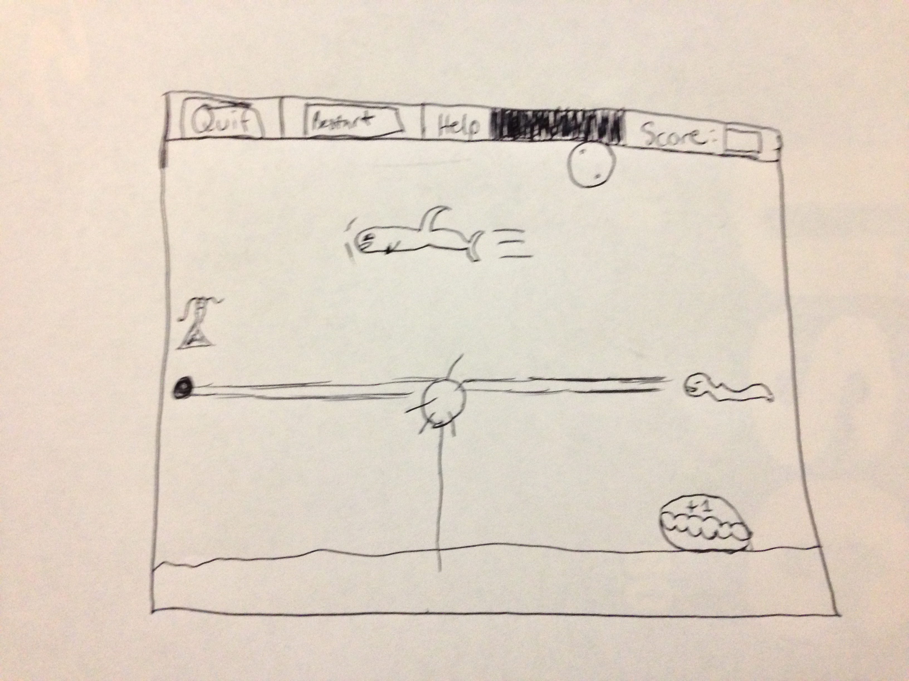

# Game Design Document

#Under The Deep Blue Sea

## Objective
Lilla the mermaid princess needs your help to escape the evils in the sea that will stop at nothing to capture her before
she gets to her castle!  The objective of the game is to help save Lilla by clearing her path of dangerous obstacles and 
controlling her character to avoid the various sharks and eels chasing her.  The longer a player survives, the higher the 
score he/she receives.  Play through up to three levels to reach the castle.

##Layout
The Layout is depicted in the picture link below:

## In Game Objects
#### Object 1: Sharks
Sharks will wait a couple seconds, and then charge full speed at Lilla.  They do not change vertical position, so Lilla can
dodge them by moving up or down after the charge begins.  If Lilla is hit, she will lose a life.

#### Object 2: Eels
Eels will shoot a laser blast form the right to the left side of the screen that can sear Lilla's scales.  If she is hit,
she will lose a life.

#### Object 3: Floating Mines
Floating mines will appear throughout the game in randomized locations.  The player can click them with the mouse to detonate
them before they reach Lilla or control Lilla to avoid them.  The user will be given bonus points upon click-detonating them.

  
#### Object 4: Bubble Power-Up
The bubble power up will make Lilla invincible for a period of time.  It is rare and hard to catch.  It will surround her
for the duration of the effect.

#### Object 5: Extra Life Power-Up
The extra life power-up (a clam) will simply give Lilla an extra life.

## Game Play
The user uses his/her mouse to play this game, as well as using the up and down arrow keys.  The mouse will be used to click
on mines to destroy them before Lilla reaches them, and the arrow keys will be used to dodge the sharks, eel blasts, and to 
receive the bubble and extra life power-ups.

## Scoring
The user will be assessed by how long he/she lives. The longer a user lives, the higher the score.  Furthermore, a user can
gain additional points by receiving either one of the two power-ups.  Also, as mentioned earlier, the user will receive bonus
points for click-detonating floating mines.  The score can not go down.

## Lives
The user will lose lives by being hit by a shark, an eel blast, or a mine.  Lilla starts with three lives but can gain 
additional lives via the Extra Life Power-Up.

## Buttons
### Quit Button
Quits the game.
### Restart Button
Restarts the game.
### Help Button
Shows how to play the game.

