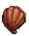

# Game Design Document

#Under The Deep Blue Sea

## Objective
Lilla the mermaid princess needs your help to escape the evils in the sea that will stop at nothing to attack her!  
The objective of the game is to help Lilla survive for as long as she can by controlling her character to 
avoid a path of dangerous obstacles and use the powers of the sea to gain lives and temporary invincibility.  The longer a 
player survives, the higher the score he/she receives.  The sea monsters will get more and more upset the longer she 
survives, so prepare for an increase in difficulty as time goes on.

##Layout
The Layout is depicted in the picture link below:

## In Game Objects
#### Object 1: Sharks
Sharks will wait a couple seconds on the right side of the ocean, and then charge full speed at Lilla, chomping its teeth.  
They do not change vertical position, so Lilla can dodge them by moving up or down after the charge begins.  
If Lilla is hit, she will lose a life.  It has no vertical velocity.

#### Object 2: Eels
Eels will wait a couple seconds and then shoot four laser blasts from the right to the left side of the screen that 
can sear Lilla's scales.  If she is hit, she will lose a life.  Eels are immobile objects.

#### Object 3: Eel Blasts
An Eel blast is a projectile blast fired from the mouth of the eel.  It travels from the right to the left side of the
screen.  It has no vertical velocity.

#### Object 4: Floating Mines
Floating mines will appear throughout the game in randomized locations, starting on the right side of the ocean.  
The player can click them with the mouse to detonate them before they reach Lilla or control Lilla to avoid them. 
 The user will be given bonus points upon click-detonating them.  They only detonate from a click, so if Lilla hits one,
 then she will simply lose a life.  It has no vertical velocity.

  
#### Object 5: Bubble Power-Up
The bubble power up will make Lilla invincible for a short period of time.  It is rare and hard to catch, for it has oscillating,
fast vertical velocity.  It will surround her for the duration of the effect, but if she moves too fast it will break away 
from her!

#### Object 6: Extra Life Power-Up
The extra life power-up (a clam) will simply give Lilla an extra life.  These are also rarer and harder to catch, using the
same moving pattern as the Bubble Power Up, although providing a different mechanic (an extra life) upon collision with Lilla.

## Game Play
The user uses his/her mouse to play this game, as well as using the W (move up) and S (move down) arrow keys.  The mouse 
will be used to click on mines to destroy them before Lilla reaches them, and the W and S keys will be used to dodge the
 sharks, eel blasts, and to receive the bubble and extra life power-ups.

## Scoring
The user will be assessed by how long he/she lives. The longer a user lives, the higher the score.  Furthermore, as mentioned
 earlier, the user will receive bonus points for click-detonating floating mines.  The score can not go down.

## Lives
The user will lose lives by being hit by a shark, an eel blast, or a mine.  Lilla starts with three lives but can gain 
additional lives via the Extra Life Power-Up.  Note: When Lilla loses a life, she will flash and be granted 1 second of 
invincibility so that she doesn't die from multiple attacks at once.

## Buttons
### Start Button
Starts the game.  Three enemies or power-ups will be generated at the very beginning of the game.  After that, the amount of
enemies spawned depends on how long the player survives.  If a game is already running, click this will start a new game.
Thus, this button acts as a start button and a reset button.
### Quit Button
Quits the game.
### Pause Button
Pauses the game.  The user cannot move Lilla while the game is paused.

## Picture Information
Pictures were found at the following website: http://www.spritedatabase.net. I do not claim any rights or ownership
to these photos.

